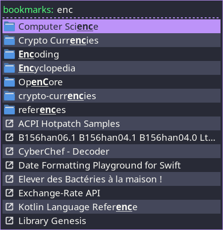

# rofi-bookmarks

## Dependencies
This tool requires bash, firefox and sqlite3.

## Usage
Select a profile using `select_profile.sh`. The default profile is usually denoted:
```sh
./select_profile.sh
```
```
1) xxxxxxxx.dev-edition-default
2) xxxxxxxx.default
...
```

Run `rofi-bookmarks`, or add it to your keyboard shortcuts.
```sh
./rofi-bookmarks
# Or use rofi directly:
# rofi -show bookmarks -modi "bookmarks:./get_bookmarks.sh" -show-icons
```


